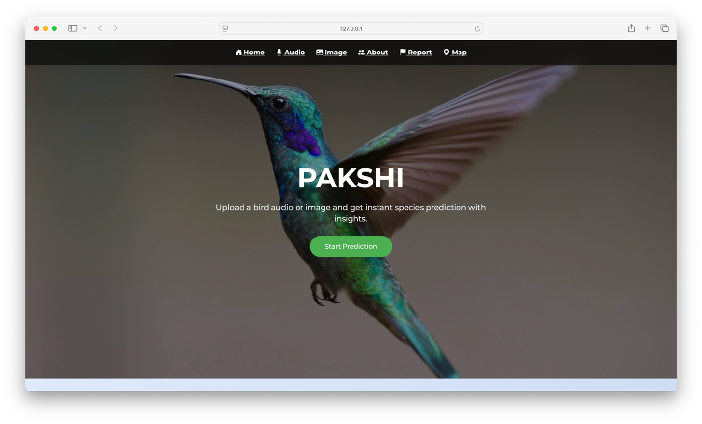
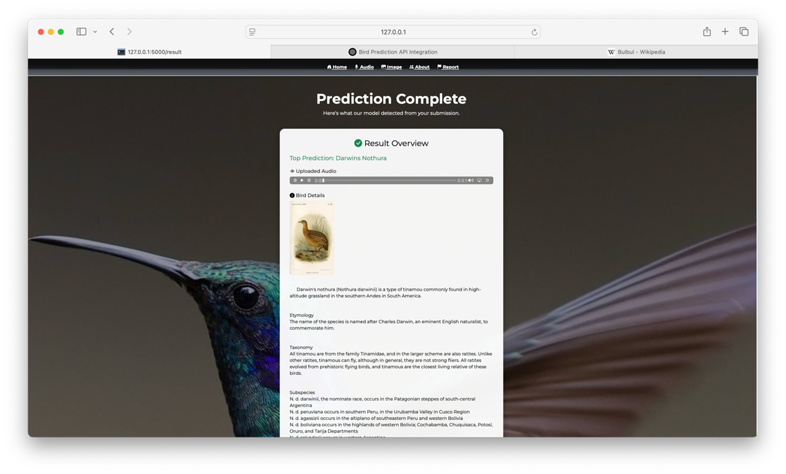
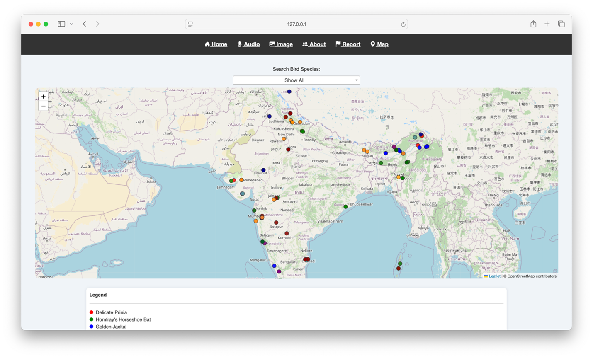

A deep learning-based application that identifies bird species from both images and audio recordings. It uses MobileNetV2 for efficient image classification and CNN models trained on spectrograms/MFCCs for audio analysis. 
Built with TensorFlow, PyTorch, and Librosa, and integrated into a Flask web app for real-time predictions. Trained on datasets like CUB-200, Xeno-Canto, and BirdCLEF.

This screenshot shows the prediction result of the Bird Recognition System. It displays the top predicted species (Darwin's Nothura) from an uploaded audio file, along with an image, audio playback, and detailed bird information all rendered via a Flask web interface.

The Following Screenshot displays the Top-5 prediction probabilities from the Bird Recognition System in bar chart format. It shows Darwin’s Nothura as the most likely species, with significantly higher confidence than others. The page also includes a location input for mapping sightings and navigation buttons for user interaction.

The Bird Recognition System also displays the region in which the Specific Bird Species are spoted using the MAP.

Cheers and Happy Coding :)

